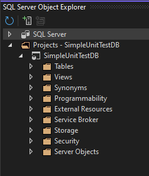

SQL Server Unit Test
[Doc](<https://learn.microsoft.com/en-us/sql/ssdt/walkthrough-creating-and-running-a-sql-server-unit-test?view=sql-server-ver16>)

## [Create a Script that Contains a Database Schema](<https://learn.microsoft.com/en-us/sql/ssdt/walkthrough-creating-and-running-a-sql-server-unit-test?view=sql-server-ver16#CreateScript>)

Create a single script holding the schema.
It create a Sales Schema
A few tables which are later altered to add constraints and procedures.

## [Create a Database Project and Import a Schema](<https://learn.microsoft.com/en-us/sql/ssdt/walkthrough-creating-and-running-a-sql-server-unit-test?view=sql-server-ver16#CreateProjectAndImport>)

Create a SQL Server Database Project

Import the SQL File from previous step.
It will get parsed and the objects will be created.

> The Sales.uspFillOrder procedure contains an intentional coding error fixed later.

This is the wizard after the process successfully happened.


The Solution Explorer shows the different objects which are sorted by schema and object type.
Furthermore, there is a *ScriptsIgnoredOnImport.sql* script that contains irrelevant code such as `PRINT` clauses.


In SQL Server Object Explorer the project got added too. The structure ressemble the one we could see in SSMS.



## [Deploying to LocalDB](<https://learn.microsoft.com/en-us/sql/ssdt/walkthrough-creating-and-running-a-sql-server-unit-test?view=sql-server-ver16#DeployDBProj>)

This operation is extremely complex. It consist of pressing <kbd>F5</kbd>

It prompts you for connection information but is prefilled already with expected values.


It actually fails. Likely because the database does not exist. This is actually an interesting point to notice there is no mention of a DATABASE name.
The reason for that I see is it would tightly couple our code to a specific database. No doing so enables us to switch database at will.
We can therefore deploy to different environments by simply picking the right one.
We can also simply have a LocalDB created instead of connecting to an actual Database.

```log
Build started at 23:39...
------ Build started: Project: SimpleUnitTestDB, Configuration: Debug Any CPU ------
Failed to debug this project because no SQL Server has been installed on the local machine. Please set the debug connection string in the project properties page.
Error: Class not registered

Class not registered

========== Build: 0 succeeded or up-to-date, 1 failed, 0 skipped ==========
========== Build completed at 23:42 and took 02:28,559 minutes ==========
========== Deploy: 0 succeeded, 0 failed, 0 skipped ==========
========== Deploy completed at 23:42 and took 02:28,560 minutes ==========
```


I will create the database manually

```sql
CREATE DATABASE SimpleUnitTestDB
```


This time the connection test works and the rest should go smooth


Oddly got the same error.

```log
Build started at 00:00...
------ Build started: Project: SimpleUnitTestDB, Configuration: Debug Any CPU ------
Failed to debug this project because no SQL Server has been installed on the local machine. Please set the debug connection string in the project properties page.
Error: Class not registered

Class not registered

========== Build: 0 succeeded or up-to-date, 1 failed, 0 skipped ==========
========== Build completed at 00:01 and took 01:00,338 minutes ==========
========== Deploy: 0 succeeded, 0 failed, 0 skipped ==========
========== Deploy completed at 00:01 and took 01:00,338 minutes ==========
```

This time the connection string has been set in the configuration as suggested.


Also the deployment seems to have been successful.

```log
Build started at 00:04...
------ Build started: Project: SimpleUnitTestDB, Configuration: Debug Any CPU ------
		C:\Program Files\Microsoft Visual Studio\2022\Community\MSBuild\Current\Bin\Roslyn\csc.exe /noconfig /nowarn:1701,1702,2008 /fullpaths /nostdlib+ /errorreport:prompt /warn:4 /define:DEBUG;TRACE /errorendlocation /preferreduilang:en-US /highentropyva+ /reference:"C:\Program Files (x86)\Reference Assemblies\Microsoft\Framework\.NETFramework\v4.7.2\mscorlib.dll" /debug+ /debug:full /optimize- /out:obj\Debug\SimpleUnitTestDB.dll /subsystemversion:6.00 /target:library /warnaserror- /utf8output /langversion:7.3 "C:\Users\UchiTesting\AppData\Local\Temp\.NETFramework,Version=v4.7.2.SqlClrAttributes.cs"
		Loading project references...
		Loading project files...
		Building the project model and resolving object interdependencies...
		Validating the project model...
		Writing model to D:\Users\UchiTesting\Desktop\repos\SQL\ML-SQL-UnitTest\SimpleUnitTestDB\SimpleUnitTestDB\obj\Debug\Model.xml...
		SimpleUnitTestDB -> D:\Users\UchiTesting\Desktop\repos\SQL\ML-SQL-UnitTest\SimpleUnitTestDB\SimpleUnitTestDB\bin\Debug\SimpleUnitTestDB.dll
		SimpleUnitTestDB -> D:\Users\UchiTesting\Desktop\repos\SQL\ML-SQL-UnitTest\SimpleUnitTestDB\SimpleUnitTestDB\bin\Debug\SimpleUnitTestDB.dacpac
------ Deploy started: Project: SimpleUnitTestDB, Configuration: Debug Any CPU ------
		Deployment script generated to:
D:\Users\UchiTesting\Desktop\repos\SQL\ML-SQL-UnitTest\SimpleUnitTestDB\SimpleUnitTestDB\bin\Debug\SimpleUnitTestDB.sql

		Creating database SimpleUnitTest...
		Creating Schema [Sales]...
		Creating Table [Sales].[Orders]...
		Creating Table [Sales].[Customer]...
		Creating Default Constraint [Sales].[Def_Orders_OrderDate]...
		Creating Default Constraint [Sales].[Def_Orders_Status]...
		Creating Default Constraint [Sales].[Def_Customer_YTDOrders]...
		Creating Default Constraint [Sales].[Def_Customer_YTDSales]...
		Creating Foreign Key [Sales].[FK_Orders_Customer_CustID]...
		Creating Check Constraint [Sales].[CK_Orders_FilledDate]...
		Creating Check Constraint [Sales].[CK_Orders_OrderDate]...
		Creating Procedure [Sales].[uspPlaceNewOrder]...
		Creating Procedure [Sales].[uspNewCustomer]...
		Creating Procedure [Sales].[uspFillOrder]...
		Creating Procedure [Sales].[uspCancelOrder]...
		Creating Procedure [Sales].[uspShowOrderDetails]...
		Update complete.
========== Build: 1 succeeded or up-to-date, 0 failed, 0 skipped ==========
========== Build completed at 00:05 and took 14,268 seconds ==========
========== Deploy: 1 succeeded, 0 failed, 0 skipped ==========
========== Deploy completed at 00:05 and took 14,268 seconds ==========
```

 ## [Create SQL Server Unit Tests](<https://learn.microsoft.com/en-us/sql/ssdt/walkthrough-creating-and-running-a-sql-server-unit-test?view=sql-server-ver16#CreateDBUnitTests>)

From SQL Server Object Explorer project created earlier, we can right click on a stored procedure to display the "Create Unit Tests..." option.

- It checks only the stored procedure over which the mouse was clicked.
- If multiple file were selected they will be checked.
- If we click from a parent folder, their child items are all checked


We can still change that on the next dialog


We are expected to check the box to automatically deploy upon running unit tests


The test designer appears


Running the tests at this point gives a bit of everything.

